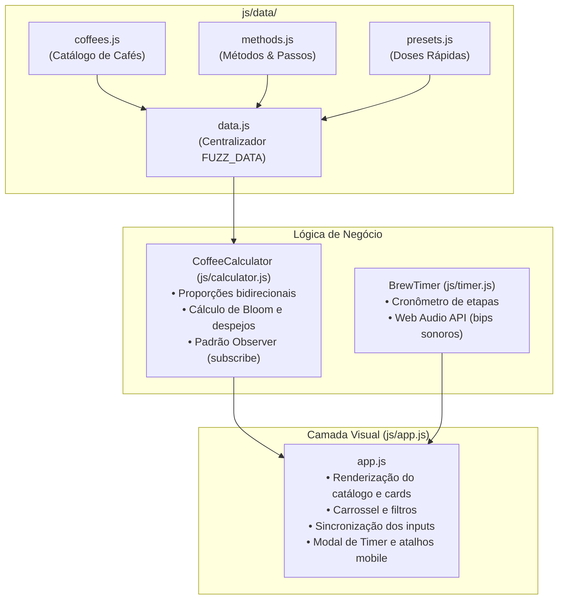

# 🏗️ Arquitetura e Guia de Desenvolvimento

Documentação técnica da Calculadora e Catálogo Interativo da **Fuzz Cafés**.

---

## 📐 Visão Geral da Arquitetura

O projeto foi construído propositalmente em **Vanilla JavaScript, HTML5 e CSS3 modernos**, sem dependência de frameworks compilados (como React, Vue ou Webpack). Essa decisão de design garante:
1. **Zero Degradação ao Longo do Tempo**: Não quebra por atualizações de dependências do npm.
2. **Execução Direta Offline**: Pode ser executado dando dois cliques em `index.html` via protocolo `file:///` ou hospedado em qualquer servidor estático (GitHub Pages, Vercel, Netlify, Tray E-commerce).
3. **Desempenho Imediato**: Carregamento instantâneo, sem pacotes pesados ou hidratação demorada.



---

## 📁 Estrutura de Diretórios

```
fuzz/
├── index.html                   # Estrutura semântica da página
├── package.json                 # Metadados do projeto e scripts de teste
├── test_data.js                 # Script de validação automática de dados
├── test_calc.js                 # Testes unitários da lógica matemática da calculadora
├── README.md                    # Visão geral do repositório
├── INTEGRACAO_MENU.md          # Manual de inserção no menu da Tray
│
├── docs/                        # Documentação Técnica e de Negócio
│   ├── GUIA_CAFES_E_RECEITAS.md # Manual para baristas e cadastro de produtos
│   └── ARQUITETURA_E_DESENVOLVIMENTO.md # Este documento
│
├── js/
│   ├── data/
│   │   ├── coffees.js          # Catálogo de cafés Fuzz com notas e fotos
│   │   ├── methods.js          # Métodos de preparo, granulometria e tempos
│   │   └── presets.js          # Doses pré-configuradas (xícara, caneca, garrafa)
│   ├── data.js                 # Agrupador do FUZZ_DATA para compatibilidade
│   ├── calculator.js           # Mecanismo reativo de proporções (Ratio)
│   ├── timer.js                # Mecanismo do cronômetro com feedback sonoro
│   ├── method-icons.js         # Mapeamento de ilustrações dos métodos
│   └── app.js                  # Controlador da interface e eventos de tela
│
├── css/
│   └── styles.css              # Variáveis de cor, grid, carrossel e animações
│
└── assets/
    ├── logo-fuzz.png           # Logotipo oficial
    ├── coffees/                # Fotografias dos pacotes de café
    ├── mascot/                 # Ilustrações do mascote Nico
    └── methods/                # Ilustrações artísticas dos 9 métodos de preparo
```

---

## 🧮 Lógica de Cálculo Bidirecional (`js/calculator.js`)

A classe `CoffeeCalculator` gerencia o estado da receita e permite alteração bidirecional com precisão:

### Fórmulas Matemáticas:
1. **Quando o usuário altera o volume de água ($V_{ml}$)**:
   $$\text{Café em gramas} = \frac{V_{ml}}{\text{Ratio}}$$
2. **Quando o usuário altera as gramas de café ($P_{g}$)**:
   $$V_{ml} = P_{g} \times \text{Ratio}$$
3. **Cálculo automático de Bloom (Pré-infusão)**:
   $$\text{Água do Bloom} = \text{round}(P_{g} \times 2.5)$$
4. **Cálculo do primeiro despejo**:
   $$\text{Primeiro Despejo} = \text{round}((V_{ml} - \text{Bloom}) \times 0.5 + \text{Bloom})$$

### Padrão Reativo (Observer):
```javascript
const calc = new CoffeeCalculator(FUZZ_DATA);

// A UI se inscreve para receber atualizações automáticas
calc.subscribe((state) => {
  // state contém: waterMl, coffeeGrams, bloomWater, grind, temp, etc.
  atualizarInterface(state);
});
```

---

## 🔊 Cronômetro com Web Audio API (`js/timer.js`)

O `BrewTimer` não depende de arquivos de áudio externos (`.mp3` ou `.wav`), que poderiam falhar ao carregar ou sofrer com bloqueio de CORS.

Ele utiliza osciladores nativos do navegador (`AudioContext`):
- **Bip de transição de etapa**: Onda senoidal a 880 Hz (nota Lá5) com envelope de atenuação rápida (0.15s).
- **Alerta de finalização**: Três bips ascendentes (660 Hz $\rightarrow$ 880 Hz $\rightarrow$ 1100 Hz).

---

## 🧪 Como Rodar Testes e Validações

O projeto conta com validações completas em Node.js:

```bash
# Validar dados do catálogo (imagens, links, IDs e passos)
node test_data.js

# Validar cálculos matemáticos da calculadora
node test_calc.js

# Executar todos os testes de uma vez
npm.cmd test
```
